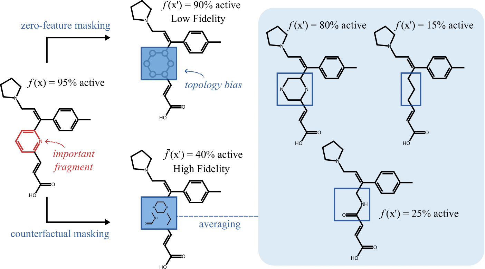

# Enhancing Chemical Explainability Through Counterfactual Masking



## Abstract
Molecular property prediction is a crucial task that guides the design of new compounds, including drugs and materials. While explainable artificial intelligence methods aim to scrutinize model predictions by identifying influential molecular substructures, many existing approaches rely on masking strategies that remove either atoms or atom-level features to assess importance via fidelity metrics. These methods, however, often fail to adhere to the underlying molecular distribution and thus yield unintuitive explanations. In this work, we propose counterfactual masking, a novel framework that replaces masked substructures with chemically reasonable fragments sampled from generative models trained to complete molecular graphs. Rather than evaluating masked predictions against implausible zeroed-out baselines, we assess them relative to counterfactual molecules drawn from the data distribution. Our method offers two key benefits: (1) molecular realism underpinning robust and distribution-consistent explanations, and (2) meaningful counterfactuals that directly indicate how structural modifications may affect predicted properties. We demonstrate that counterfactual masking is well-suited for benchmarking model explainers and yields more actionable insights across multiple datasets and property prediction tasks. Our approach bridges the gap between explainability and molecular design, offering a principled and generative path toward explainable machine learning in chemistry.

### [Paper](https://arxiv.org/abs/2508.18561)


## Setup
The project uses **Python 3.11.5**.
```bash
git clone --branch main --recurse-submodules git@github.com:gmum/counterfactual-masking.git

cd counterfactual-masking/DiffLinker
# Download the DiffLinker model checkpoint
mkdir -p models
wget "https://zenodo.org/record/7121300/files/zinc_difflinker_given_anchors.ckpt?download=1" -O models/zinc_difflinker_given_anchors.ckpt
cd ../

# Download and extract the CReM dataset (ChEMBL22)
mkdir data
wget "https://www.qsar4u.com/files/cremdb/chembl22_sa2.db.gz" -O data/chembl22_sa2.db.gz
gunzip data/chembl22_sa2.db.gz

# Libraries
pip install torch==2.5.1+cu124 --index-url "https://download.pytorch.org/whl/cu124"
pip install -r requirements.txt

# DiffLinker
pip install -e .
```


## Usage
To mask selected atoms in your molecules, you can use one of the following functions:
```bash
from source.linksGenerator import crem_fragment_replacement, diffLinker_fragment_replacement

output = diffLinker_fragment_replacement(mol: rdkit.Chem.Mol, toDelete: list[int])
output = crem_fragment_replacement(mol: rdkit.Chem.Mol, toDelete: list[int])
```
- mol — the input molecule in which you want to mask a fragment.
- toDelete — a list of atom indices (nodes) that should be masked.

The output is a set of molecules where the specified atoms have been replaced according to the chosen masking strategy.

## Reproducing the Results

## Dataset: Common Substructure Pair

**Note:** A preprocessed and filtered version of the Common Substructure Pair dataset is included in the repository and can be found in the `data_pubchem` directory.

### Regenerate the Dataset

To regenerate the dataset:

```bash
python -m scripts.superstructures.fetch_superstructures --output_folder data_pubchem --dataset_name common_substructure_pair_dataset
```

This script fetches superstructures from PubChem, processes them, and saves the results in the specified directory.

## Pairs Experiment
This experiment evaluates different masking strategies over pairs of molecules that share common substructures.

### Step 1: Train a Model

```bash
python -m source.train --model_size 512 --dropout 0.3 --batch_size 64 --seed 5
```

### Step 2: Run Pairs Experiment 

* **Single anchor**

```bash
python -m scripts.pairs_experiment.pairs_prediction --output_folder single_anchor_output  --model_path checkpoints/gin/model_trained_without_salts_hidden_512_dropout_0.3_seed_5.pth --pairs_dataset data_pubchem/common_substructure_pair_dataset.json --size_model 512 --same_anchors --number_of_anchors 1
```

* **Multiple anchors**

```bash
python -m scripts.pairs_experiment.pairs_prediction --output_folder 2_or_more_anchors_output  --model_path checkpoints/gin/model_trained_without_salts_hidden_512_dropout_0.3_seed_5.pth --pairs_dataset data_pubchem/common_substructure_pair_dataset.json --size_model 512 --number_of_anchors 2 --same_anchors
```

* **No anchor restrictions (Both variants)**
```bash
python -m scripts.pairs_experiment.pairs_prediction --output_folder no_restrictions_output  --model_path checkpoints/gin/model_trained_without_salts_hidden_512_dropout_0.3_seed_5.pth --pairs_dataset data_pubchem/common_substructure_pair_dataset.json --size_model 512 --same_anchors
```

### Step 3: View the Results
Open the following notebook to visualize results:
```bash
scripts/pairs_experiment/results_visualization_masking_evaluation.ipynb
```

## Counterfactuals Experiment

This experiment evaluates different counterfactual generation methods.

### Step 1: Train Models

```bash
python -m scripts.counterfactuals_experiment.models_training
```

### Step 2: Run Counterfactuals Experiment 
```bash
python -m scripts.counterfactuals_experiment.counterfactuals_generation --model_size 512  --seed <SEED> --dataset <DATASET> --model_path <MODEL_PATH>
```
### Parameters
| Argument        | Description                       | Used Values                                                                 |
|----------------|-----------------------------------|----------------------------------------------------------------------------------------|
| `--model_size` | Hidden size of the model          | `512`                                                                                  |
| `--seed`       | Random seed                       | `5`, `15`, `25`                                                                        |
| `--dataset`    | Name of the dataset               | `CYP3A4_Veith`, `CYP2D6_Veith`, `hERG`                                                 |
| `--model_path` | Path to the trained model file    | e.g., `checkpoints/gin_cyp2d6_veith/model_CYP2D6_Veith_hidden_512_dropout_0.3_seed_15.pth`        |


### Step 3: View the Results

```bash
python -m scripts.counterfactuals_experiment.counterfactuals_results_reader --dataset <DATASET>
```
### Parameters
| Argument        | Description                       | Used Values                                                                 |
|----------------|-----------------------------------|----------------------------------------------------------------------------------------|
| `--dataset`    | Name of the dataset               | `CYP3A4_Veith`, `CYP2D6_Veith`, `hERG`                                                 |


## Explainers Experiment

### Step 1: Train Models

```bash
(cd scripts/explainers_experiment && python step_01_training.py)
```
Training parameters are defined in `scripts/explainers_experiment/config.yaml`.

### Step 2: Run Explainers Experiment 
```bash
(cd scripts/explainers_experument && python step_02_masking.py)
```
Experiment parameters are defined in `scripts/explainers_experiment/config.yaml`.

### Step 3: Summmary of results (Table 3)
```bash
(cd scripts/explainers_experiment && jupyter execute step_03_summary.ipynb)
```


## License and legal

This project is released under the MIT License.

## Funding
The work of Ł.J., M.K., and B.Z. was funded by the "Interpretable and Interactive Multimodal Retrieval in Drug Discovery" project. The "Interpretable and Interactive Multimodal Retrieval in Drug Discovery” project (FENG.02.02-IP.05-0040/23) is carried out within the First Team programme of the Foundation for Polish Science co-financed by the European Union under the European Funds for Smart Economy 2021-2027 (FENG). The work of T.D. was carried out within the "AI-Based Virtual Screening Assistant" project (LIDER15/0033/2024) funded by the National Center for Research and Development (Poland) under the LIDER XV program. We gratefully acknowledge Polish high-performance computing infrastructure PLGrid (HPC Center: ACK Cyfronet AGH) for providing computer facilities and support within computational grant no. PLG/2025/018272.

## Citation
If you find this work useful, please cite our paper:

```
@article{janisiow2026counterfactualmasking,
   title={Enhancing Chemical Explainability Through Counterfactual Masking},
   journal={Proceedings of the AAAI Conference on Artificial Intelligence},
   publisher={Association for the Advancement of Artificial Intelligence (AAAI)},
   author={Janisi{\'o}w, {\L}ukasz and Kocha{\'n}czyk, Marek and Zieli{\'n}ski, Bartosz and Danel, Tomasz},
   year={2026}
   }
```
