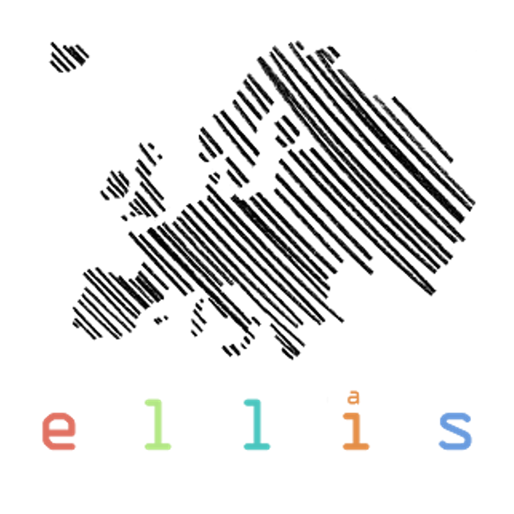

---
hide:
  - toc
  - navigation
---

  

    <figure style="text-align: center;">
      
      <figcaption>
        Łukasz Janisiów 
        PhD Candidate 
        Jagiellonian University 
        ELLIS PhD Student
      </figcaption>
    </figure>
    <figure style="text-align: center;">
      
      <figcaption>
        Marek Kochańczyk 
        Assistant Professor 
        Jagiellonian University 
      </figcaption>
    </figure>
    <figure style="text-align: center;">
      
      <figcaption>
        Bartosz Zieliński 
        Associate Professor 
        Jagiellonian University 
        ELLIS Member
      </figcaption>
    </figure>
    <figure style="text-align: center;">
      
      <figcaption>
        Tomasz Danel 
        Post-Doc 
        Jagiellonian University 
        Senior ML Scientist
      </figcaption>
    </figure>
  

## Contact

For questions, please open an issue on GitHub or contact Tomasz Danel or Łukasz Janisiów (tomasz.danel &lt;at&gt;.uj.edu.pl, lukasz.janisiow &lt;at&gt; doctoral.uj.edu.pl).

  

    
    
    
  

  

[:material-attachment: Paper](https://arxiv.org/abs/2508.18561){ .md-button } [:material-github: Code](https://github.com/gmum/counterfactual-masking){ .md-button } [:material-rocket: Get started](../user-guide/setup.md){ .md-button .md-button--primary }

