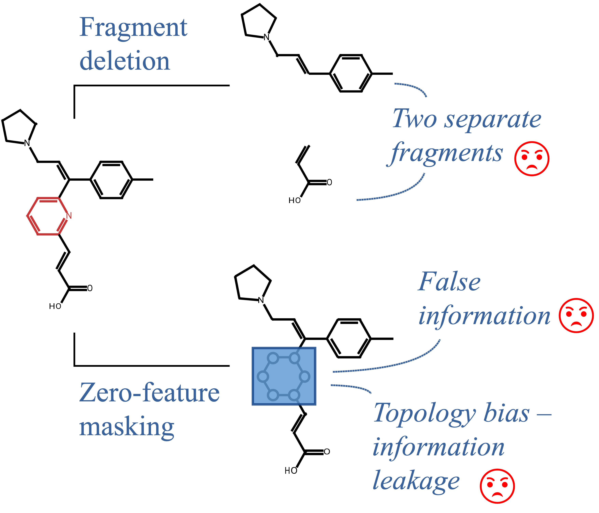
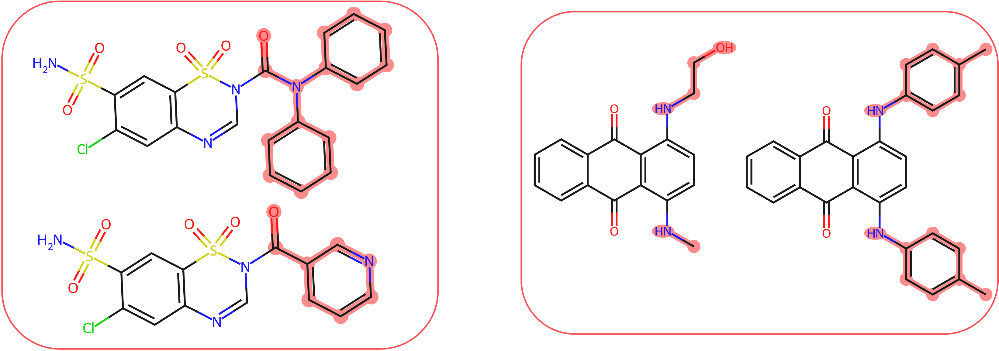

---
hide:
  - toc
  - navigation
---

<style>
.md-button {
    margin-bottom: .2rem;
}
</style>

<div style="text-align: center; margin-bottom: 3em;" markdown>
{width="60%"}
<h1 style="margin-bottom: 0.1em !important;">Enhancing Chemical Explainability Through Counterfactual Masking</h1>

Łukasz Janisiów, Marek Kochańczyk, Bartosz Zieliński, Tomasz Danel

Jagiellonian University, Poland

AAAI-26 Conference Proceedings

[:material-attachment: Paper](https://arxiv.org/abs/2508.18561){ .md-button }  [:material-github: Code](https://github.com/gmum/counterfactual-masking){ .md-button } [:material-presentation: Poster](imgs/poster.pdf){ .md-button }
</div>


!!! abstract "Tl;DR"
    A new masking method designed specifically for molecular graphs that replaces molecule parts with realistic alternatives, giving more meaningful and useful explanations for molecular property predictions than standard masking methods, which often lead to out-of-distribution samples.

## Motivation: Molecular Masking Is Broken

<div style="display: flex; align-items: center; gap: 2em; margin-bottom: 3em;">
  <div style="flex: 1;">
    <p>
      When atoms or bonds are naively masked (by zeroing features or deleting parts of molecule), the resulting molecules often become <strong>chemically implausible or physically impossible</strong>, producing examples that fall outside the training distribution. This <strong>out-of-distribution problem</strong> undermines the reliability of both the explanations and their evaluation metrics. Furthermore, current masking approaches inadvertently <strong>leak information</strong> about the original graph topology to the model: even when certain atoms are “masked,” their structural relationships and connectivity pattern remain implicitly encoded in the modified graph.
    </p>
  </div>

  <div style="flex: 1; text-align: center;">
    
  </div>
</div>


## Solution: Counterfactual Masking (CM)
</p>
Instead of zeroing features or deleting atoms, <strong>Counterfactual Masking (CM)</strong> masks by replacing important molecular fragments with <strong>chemically plausible alternatives</strong>. This enables a direct comparison between the model’s prediction for the original molecule and the average prediction across valid counterfactuals (i.e., all possible alternatives).
By doing so, CM:

<ul>
  <li>Provides <strong>chemically grounded</strong> and <strong>robust explanations</strong></li>
  <li>Clarifies <strong>why specific fragments drive predictions</strong></li>
</ul>

<div style="text-align: center; margin-bottom: 3em;" markdown>
{width="80%"}
</div>

## Evaluation of Fragment Masking

<div style="display: flex; align-items: center; gap: 2em; margin-bottom: 3em;">
  <div style="flex: 1;">
    <p>
      To evaluate different masking techniques, we used the common substructure pair dataset, which contains pairs of molecules with the same core structure. In each pair, we masked the fragments that were not shared and measured the difference in the model’s predictions. An ideal masking technique should completely obscure the masked fragment, resulting in identical predictions for both molecules in the pair.
    </p>
  </div>
  <div style="flex: 1; text-align: center;">
    
  </div>
</div>

<div style="display: flex; align-items: center; gap: 2em; margin-bottom: 3em;">
  <div style="flex: 1; text-align: center;">
    
  </div>

  <div style="flex: 1;">
    <p>
      We found that the common masking method, feature zeroing, produces molecules that are out of distribution and, because of that, very often leads to unreliable explanations.
      While Counterfactual Masking using DiffLinker or CReM produces molecules much closer to the training distribution, explanations based on them are more faithful.
    </p>
  </div>

</div>

## Can We Generate Counterfactuals?

<div style="display: flex; align-items: center; gap: 2em; margin-bottom: 3em;">
  <div style="flex: 1;">
    <p>
      Although originally designed for masking tasks, CM can effectively generate realistic, chemically valid counterfactual examples by ensuring that molecules stay within the data distribution. In comparison to other counterfactual generation methods, it also enables targeted, local modifications to specific fragments, which can be easily interpreted by people with a chemistry background.
    </p>
  </div>

  <div style="flex: 1; text-align: center;">
    
  </div>
</div>

<div style="text-align: center; margin: 3em 0;" markdown="1">

### 📄 For full tables and results:

[:material-attachment: Read the Paper](https://arxiv.org/abs/2508.18561){ .md-button .md-button--primary .paper-button }

</div>


## Acknowledgements

This study was funded by the ”Interpretable and Interactive Multimodal Retrieval in Drug Discovery” project. The ”Interpretable and Interactive Multimodal Retrieval in Drug Discovery” project (FENG.02.02-IP.05-0040/23) is carried out within the First Team programme of the Foundation for Polish Science co-financed by the European Union under the European Funds for Smart Economy 2021-2027 (FENG). We gratefully acknowledge Polish high-performance computing infrastructure PLGrid (HPC Center: ACK Cyfronet AGH) for providing computer facilities and support within computational grant no. PLG/2025/018272.

## Citation


```
@inproceedings{janisiow2026counterfactualmasking,
   title={Enhancing Chemical Explainability Through Counterfactual Masking},
   journal={Proceedings of the AAAI Conference on Artificial Intelligence},
   publisher={Association for the Advancement of Artificial Intelligence (AAAI)},
   author={Janisi{\'o}w, {\L}ukasz and Kocha{\'n}czyk, Marek and Zieli{\'n}ski, Bartosz and Danel, Tomasz},
   year={2026}
   }
```

## Contact

For questions, please open an issue on GitHub or contact Tomasz Danel or Łukasz Janisiów (tomasz.danel &lt;at&gt;.uj.edu.pl, lukasz.janisiow &lt;at&gt; doctoral.uj.edu.pl).

<div style="text-align: center;">
  <div style="display: inline-flex; flex-wrap: wrap; gap: 10em; align-items: center;">
    <a href="https://en.uj.edu.pl/en/" rel="noreferrer" target="_blank"></a>
    <a href="https://gmum.net/" rel="noreferrer" target="_blank"></a>
    <a href="https://ellis.eu/student/2025-lukasz-janisiow" rel="noreferrer" target="_blank"></a>
  </div>
  <a href="https://www.fnp.org.pl/en/component/fnp_programs/program/first-team-feng-eng" rel="noreferrer" target="_blank"></a>
</div>
<div style="text-align: center; margin: 2em 0" markdown>
[:material-attachment: Paper](https://arxiv.org/abs/2508.18561){ .md-button } [:material-github: Code](https://github.com/gmum/counterfactual-masking){ .md-button } [:material-rocket: Get started](user-guide/setup.md){ .md-button .md-button--primary }
</div>